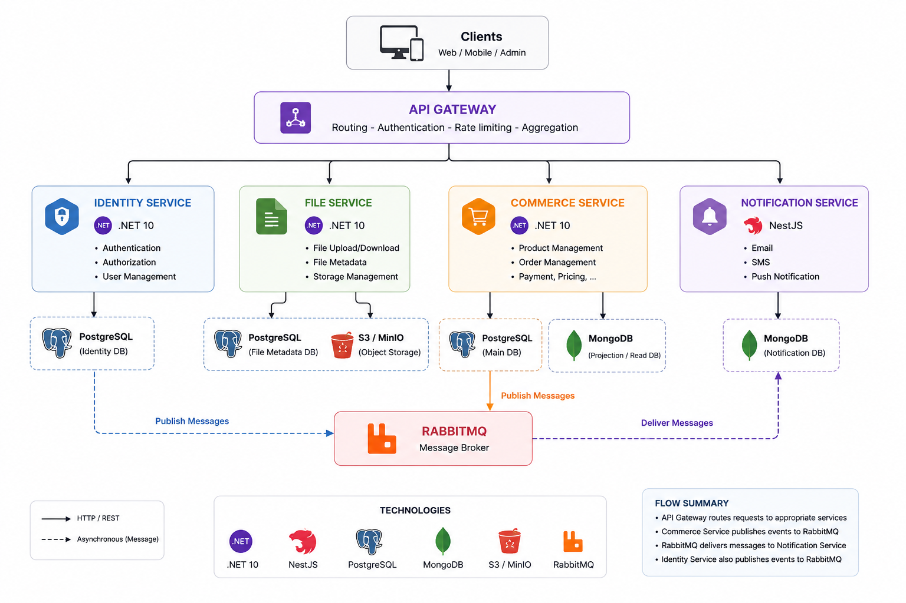

# Backend Overview

This backend is built as a microservice architecture following Clean Architecture principles, CQRS, and the Mediator pattern across all services. Each service is designed for a clear responsibility and communicates through asynchronous messaging, caching, storage, and service-to-service RPC.

## Architecture Summary

- Microservice architecture with separate bounded contexts for Identity, Commerce, Notification, and File services.
- Clean Architecture ensures separation of concerns through distinct layers: API, Application, Domain, Infrastructure, Persistence, and optional Read Model.
- CQRS is used to separate commands and queries, especially in services with complex business workflows.
- Mediator pattern is applied to decouple request handling from implementation, enabling cleaner command and query flows.
- RabbitMQ is the main message broker used to handle events and inter-service communication.
- Redis is used as a cache layer for fast access to frequently requested data.
- MinIO is used as a local AWS-compatible object storage service for file storage.
- Elasticsearch is used for product search in CommerceService.
- gRPC is used for efficient service-to-service communication.

## Technology Stack

- Notification Service: NestJS, MongoDB
- Other services: .NET 10, PostgreSQL as the primary database
- CommerceService: MongoDB is also used for read-model / read DB queries
- Messaging: RabbitMQ
- Cache: Redis
- Object storage: MinIO
- Search: Elasticsearch
- Service communication: gRPC

## Clean Architecture Layers

- API: Defines controllers, HTTP endpoints, GraphQL endpoints, or gateway contracts. This layer handles request validation and maps incoming messages to application commands and queries.
- Application: Contains business use cases, command/query handlers, validators, DTOs, and Mediator dispatch logic. This layer coordinates domain operations and orchestrates persistence and infrastructure interactions.
- Domain: Contains core business entities, value objects, domain events, and business rules. It is independent and does not depend on infrastructure or application details.
- Infrastructure: Implements external services, integration adapters, message brokers, caching, storage, search, and external API clients.
- Persistence: Manages database access, entity configurations, repository implementations, and migrations for the service data store.
- Read Model (optional): Supports query-optimized projections, search indexes, or other denormalized views to improve read performance without contaminating write models.

## Service Responsibilities

### Identity Service

- Responsible for authentication and user identity.
- Verifies who the user is and exposes authentication tokens.
- Manages user records, refresh tokens, password reset tokens, signing keys, and security logs.
- Handles login, registration, token refresh, and password reset flows.

### Commerce Service

- Responsible for commerce domain operations including catalog management, products, brands, categories, and product variants.
- Manages roles and permissions for access control.
- Supports product search through Elasticsearch in CommerceService.
- Uses PostgreSQL as the main write database and also supports a MongoDB read DB for query operations.
- Handles business activities such as product inventory, pricing, and catalog structure.

### Notification Service

- Built with NestJS and uses MongoDB as its data store.
- Responsible for dispatching notifications via email, SMS, push, or other channels.
- Tracks notification requests, payloads, status, send attempts, and error messages.
- Receives events from RabbitMQ and processes notification delivery asynchronously.

### File Service

- Responsible for managing file uploads and storage metadata.
- Uses MinIO as the local S3-compatible storage backend.
- Handles media metadata, storage keys, content type, and file references.
- Provides upload integration and storage lookup for other services.

## Integration and Messaging

- RabbitMQ is used to decouple services and enable event-driven communication.
- Services publish domain events and consume relevant events from other services.
- Redis is used for caching frequently accessed data and reducing load on services.
- gRPC is used for direct service-to-service calls where synchronous communication is required.
- MinIO stores binary files and media objects with an AWS-compatible interface.
- Elasticsearch provides fast search capabilities for products in CommerceService.

## Goals

- Maintain a scalable backend architecture with well-defined service boundaries.
- Keep business logic inside the domain and application layers.
- Enable reliable messaging and event handling across services.
- Optimize read scenarios using dedicated read models and search indexes.
- Allow each service to evolve independently while sharing core architectural patterns.
